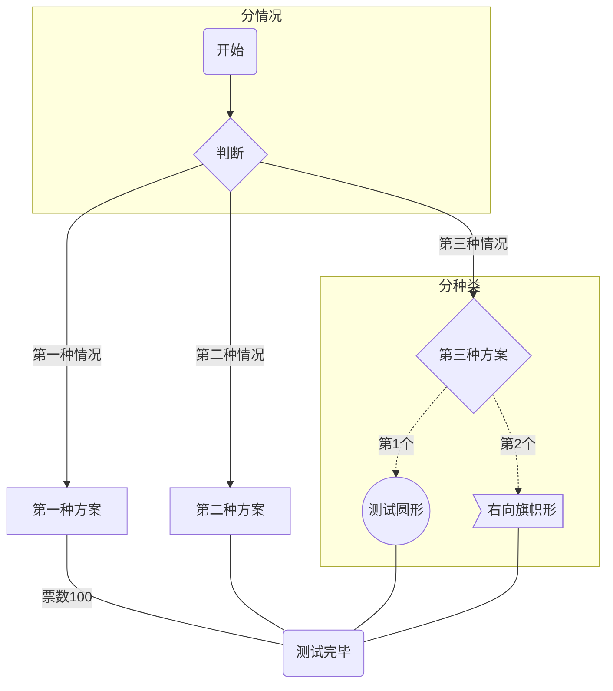

```mermaid
graph TB;
subgraph 分情况
A(开始)-->B{判断}
end
B--第一种情况-->C[第一种方案]
B--第二种情况-->D[第二种方案]
B--第三种情况-->F{第三种方案}
subgraph 分种类
F-.第1个.->J((测试圆形))
F-.第2个.->H>右向旗帜形]
end
H---I(测试完毕)
C--票数100---I(测试完毕)
D---I(测试完毕)
J---I(测试完毕)
```